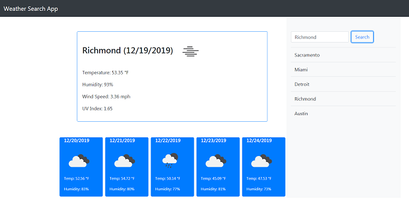

# WeatherApp

The Weather App allows the user to choose a city, then to see the current weather, as well as a 5-day forecast, for that city.  In addition, the app will store the most recent searches, and display those cities upon page load.  The most recently searched city will appear in the search box upon page load. 

The deployed app can be found here:  https://josi3006.github.io/WeatherApp/

